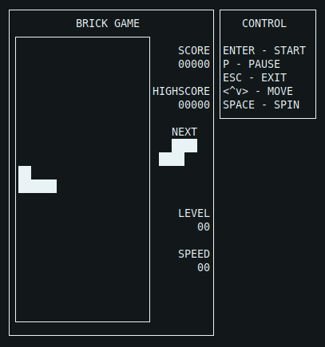

<h1 align="center">Tetris</h1>

## About project
implementation of Tetris game on C programming language. The project has two parts: library implementing the logic of the tetris game, and a terminal interface using ncurses library. In future projects more games will be developed which will be able to use that terminal interface. 
Logic of the game was formalized by finite-state machine conception.
There is schematic view of finite-state machine of tetris in repository.

### Game interface description
Game interface consist of game field with size 10x20 cells, sidebar with game information (score, high score, next figure, level, speed and pause indicator) and panel with description of control buttons.

### Gameplay
In the project there are implementation of following mechanics:
- Rotations of figures
- Horizontal moving of figures
- Acceleration of figure's fall
- Figure stops when reach bottom border and next spawns
- Destruction of filled rows with scoring points
- Level mechanic boosts figure's fall
- End of the game when the top border is reached
- High score is stored between program runs

### Preview


## Installation

#### Install dependencies
```
sudo apt install libncurses5-dev libncursesw5-dev
```

#### install game
```
make install
```
After this executable file named 'tetris' will appear in build directory of the project

## Developer
- [Alexander](https://github.com/Anchaus)

## Licence
Project Tetris_C is distributed under the MIT licence
